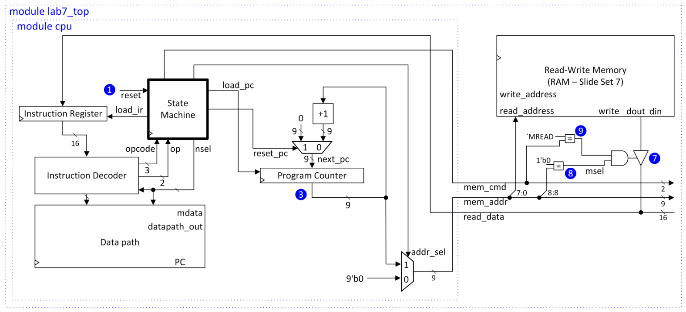
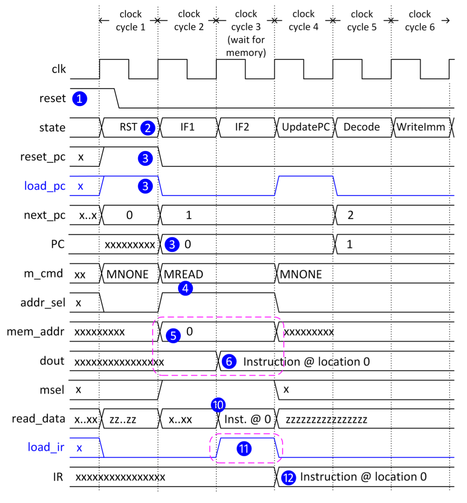
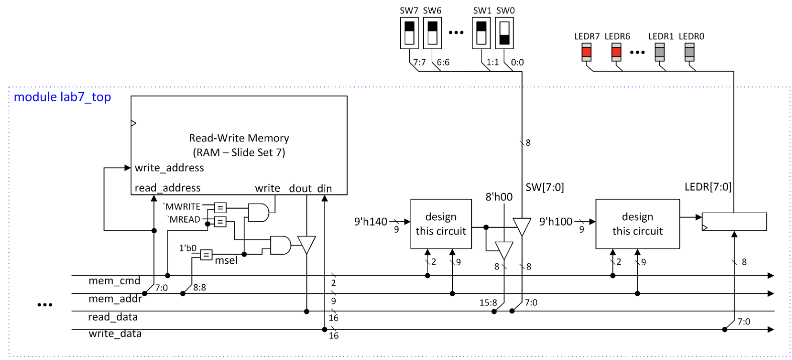
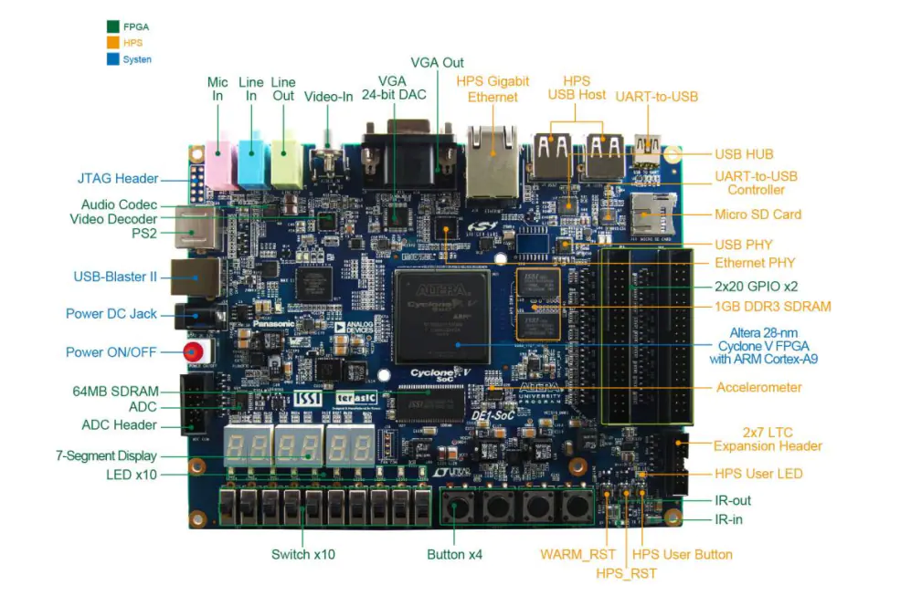

# RISC Machine

**Latest Update**: November 12, 2021

**Partner**: [Alex Lassooij](https://github.com/AlexLassooij)
## Table of Contents
- [Overview](#overview)
- [Hardware and Software Used](#hardware-and-software-used)
    - [DE1-SOC](#de1-soc)
    - [Software](#software)
- [Testing](#testing)
- [Miscellaneous](#miscellaneous)
## Overview

This CPEN 211 Term Project is developed by both my partner Alex Lassooij and I back in our first year of electrical engineering. This introduction to microcontrollers class was the first time I had been exposed to FPGAs and hardware description languages (Verilog). We had weekly labs that took  approximately 10-30 hours a week to implement and debug. Each lab is built on top of each other starting at lab 4. Lab 8 was our last lab for this RISC Machine project and was conducted as a challenge amongst our CPEN 211 class that consisted of over 200 students. We placed **11th** out of over 100 teams in processing time and efficiency.

We built an efficient instruction set architecture in Verilog consisting of datapaths, cpu, state machine, registers, and more. This can carry out various ARM instructions. At the end of this lab, a program can be written to implement any algorithm that can run within the 256 word memory that we added in Lab 7. Figure 1 shows the overall architecture of the CPU for our RISC Machine in our previous lab; lab 8 just adds a few improvements to it and optimizes it. [Lab 7 PDF](extra/lab7.pdf)

Figure 1: CPU Architecture for executing instructions from memory

Figure 5 is the hardware we implement in Verilog and it can be understood with the timing diagram in Figure 4 on how we want to set our timing execution.

Figure 2: Timing Diagram of Read and PC Update

Additionally, we extend our memory bus and add two memory mapped input/output device. This will allow us to be able to read the input values on the slider switches of the DE1-SOC using the LDR instruction and output a value to the red LEDs using the STR instruction. This is shown in Figure 3.

Figure 3: Memory mapped input and output devices 

 

## Hardware and Software Used

### DE1-SOC
The DE1-SOC is a development kit built around the the Altera System-on-Chip (SoC) FPGA. It was a robust platform to help us test our RISC Machine design. Once we synthesized our verilog program, the generated bitstream is uploaded to the DE1-SoC for us to conduct physical testing of our system.  

 

### Software
The software primarily used in our labs is **ModelSim** and **Quartus Prime**.
 

#### **ModelSim:**
We use this software to simulate our digital design as it simulates the behavior of our hardware description languages. This generates waveforms and timing diagrams for us to do logic verification. 
#### **Quartus Prime:**
We use this software to compile and synthesize hardware description language (HDL) designs. In this case, we use it to synthesize our project's HDL, Verilog. 
## Testing
### Waveform Simulation and Test Benches

Each lab we developed new portions of our RISC Machine (e.g. adding the datapath portion, etc.). With that we create test benches to ensure that that portion is integrated and tested with the system. We do this by creating scenarios of the top level of the system to run and compare it with what is expected. We also simulate these signals to see it's waveforms and the timing of the waveforms to ensure if signals are processed at the correct time.

### DE1-SOC Tests
As part of our labs we had to showcase our implementations on our DE1-SOC by flipping switches to show the binary inputs to the system and other user controlled inputs to show what the system output would be. We conducted tests like what we did for our test bench by physically inputting our inputs and expecting outputs to be values printed on the 7-segment displays of the DE1-SOC or expect led lights to turn on and etc.

## Miscellaneous

[Lab 8 PDF Link](/lab8.pdf)